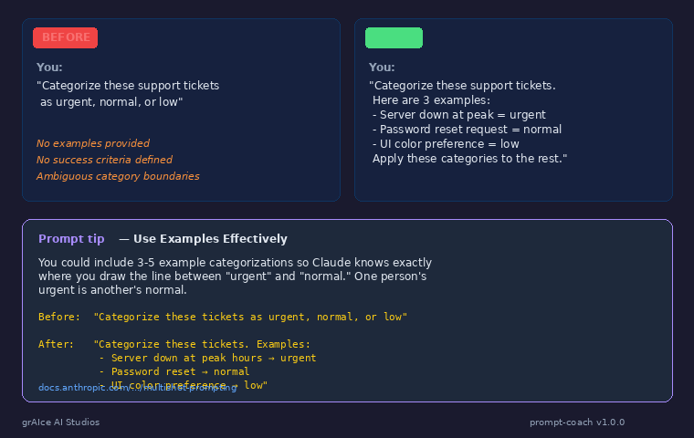

# prompt-coach

[](https://docs.anthropic.com)
[](LICENSE)
[](CHANGELOG.md)

**One prompting best practice per response. Watches how you prompt, suggests a better way.**



## Install

```bash
cp -r prompt-coach ~/.claude/skills/
```

## What It Detects

- **Missing examples** — nudges you to add 3-5 shots when categories or styles are ambiguous
- **Vague instructions** — catches prompts that leave format, length, or audience unspecified
- **No success criteria** — suggests defining what "good" looks like before Claude starts
- **Missing context** — recommends explaining the WHY behind your constraints

<details>
<summary>All 12 best practices covered</summary>

1. Be clear and direct
2. Add context to improve performance
3. Use examples effectively
4. Structure prompts with XML tags
5. Give Claude a role
6. Long context prompting
7. Control output format (positive framing)
8. Leverage thinking capabilities
9. Chain complex prompts
10. Use parallel tool calling
11. Provide clear success criteria for research
12. Minimize hallucinations

Full reference with before/after examples: [`references/best-practices.md`](references/best-practices.md)
</details>

## How It Works

- **Does your work first.** Completes whatever you asked for — never replaces the task.
- **One tip per response.** Picks the single most impactful practice for your specific prompt.
- **Stays quiet when you're good.** Simple questions and solid prompts get no nudge.
- **Peer tone, not professor tone.** "btw, you could try..." not "IMPORTANT: You should always..."

### Example

You prompt:
> "Categorize these support tickets as urgent, normal, or low"

Claude completes the categorization, then adds:

```
---
Prompt tip — Use Examples Effectively
You could include 3-5 example categorizations so Claude knows exactly where you
draw the line between "urgent" and "normal." One person's urgent is another's normal.
docs.anthropic.com/.../multishot-prompting
```

## File Structure

```
prompt-coach/
├── SKILL.md                    # Skill definition (triggers, behavior, tone)
├── references/
│   ├── best-practices.md       # All 12 practices with examples & doc links
│   └── detection-patterns.md   # Pattern-matching rules for each practice
├── evals/
│   └── evals.json              # 12 test cases — one per best practice
├── prompt-coach-preview.png    # Preview screenshot
├── README.md
├── LICENSE
└── CHANGELOG.md
```

## Credits

Built by [grAIce AI Studios](https://github.com/grAIcetech). MIT License.

Best practices sourced from [Anthropic's official prompting guide](https://docs.anthropic.com/en/docs/build-with-claude/prompt-engineering/claude-prompting-best-practices).
